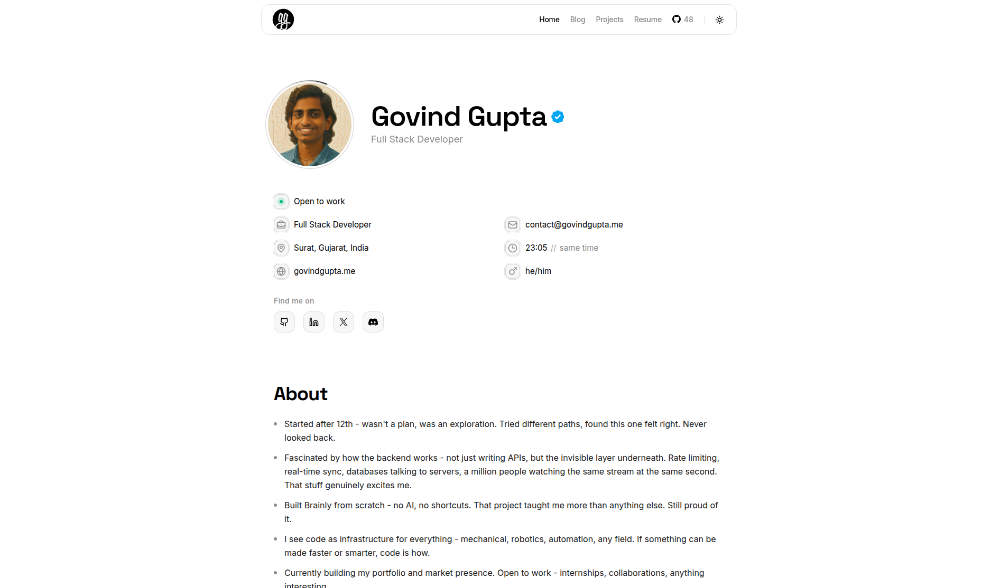

# [govindgupta.me](https://govindgupta.me) <!-- &middot;  -->

A minimal developer portfolio to showcase my professional work, selected projects, and writing.

> Check out the live site: [govindgupta.me](https://govindgupta.me)

  <a href="https://govindgupta.me">
    <picture>
      <source
        media="(prefers-color-scheme: dark)"
        srcset="./.github/assets/screenshot-desktop-dark.png"
      />
      <source
        media="(prefers-color-scheme: light)"
        srcset="./.github/assets/screenshot-desktop-light.png"
      />
      
    </picture>
  </a>

<!-- ## Star History

<a href="https://www.star-history.com/?repos=govindggupta%2Fgovindgupta.me&type=date&legend=top-left">
 <picture>
   <source media="(prefers-color-scheme: dark)" srcset="https://api.star-history.com/image?repos=govindggupta/govindgupta.me&type=date&theme=dark&legend=top-left" />
   <source media="(prefers-color-scheme: light)" srcset="https://api.star-history.com/image?repos=govindggupta/govindgupta.me&type=date&legend=top-left" />
   
 </picture>
</a> -->
